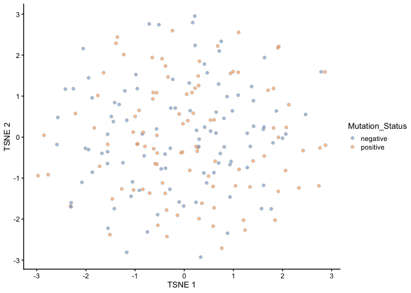
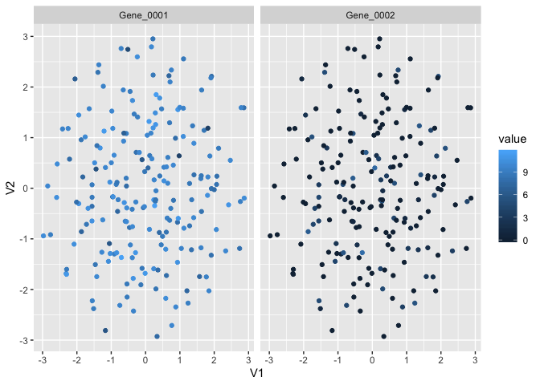

plyexperiment
================

[](https://travis-ci.org/kevinwang09/plyexperiment)

# Introduction

The S4 object in Bioconductor is great for many things. But every now
and then, I have problems manipulating the column or the row data of a
S4 object. This package provides several `dplyr`-style functions to
manipulate the column data of a S4 object.

This is an experimental package that only receives occasional updates.

# Demo

Suppose we have a `SingleCellExperiment` object, and we want to add in
the cell-type information

``` r
library(SingleCellExperiment)
library(plyexperiment)
library(dplyr)

set.seed(123)
y <- matrix(rnorm(2000), ncol=20)
sce <- SingleCellExperiment(list(counts=y))

cell_type = sample(LETTERS, ncol(y), replace=TRUE)

## Traditional indexing
sce$cell_type = cell_type

## plyexperiment syntax
sce = sce %>% mutate_col(cell_type)
```

The benefit of `plyexperiment` is similar to the benefits of `tidyverse`
syntax and benefits from chaining using the pipe operators. For example,
the filter function is useful in spliting the data based on information
in the `colData`.

``` r
sce %>% filter_col(cell_type == "A")
```

    ## class: SingleCellExperiment 
    ## dim: 100 1 
    ## metadata(0):
    ## assays(1): counts
    ## rownames: NULL
    ## rowData names(0):
    ## colnames: NULL
    ## colData names(1): cell_type
    ## reducedDimNames(0):
    ## spikeNames(0):
    ## altExpNames(0):

## Exporting `reducedDim` data

The `scater` package contains a lot of useful functions in manipulating
SingleCellExperiment objects. In particular, the `reducedDim` slot
typically stores dimensional reduced data matrices.

However, to customise the plots based on your own personal taste could
be a bit tougher. For example, if you want to overlay the expression of
a cell-type marker onto the tSNE plot.

``` r
library(scater)
```

    ## Loading required package: ggplot2

``` r
example_sce <- mockSCE()
example_sce <- logNormCounts(example_sce)
example_sce <- runTSNE(example_sce, scale_features=NULL)

plotTSNE(example_sce, colour_by = "Mutation_Status")
```

<!-- -->

``` r
(tsne_tbl = example_sce %>% 
  export_reducedDim(type = "TSNE", 
                    feature = c("Gene_0001", "Gene_0002")))
```

    ## Warning: Column `cell_name` joining character vector and factor, coercing into
    ## character vector

    ## # A tibble: 400 x 8
    ##    cell_name     V1    V2 Mutation_Status Cell_Cycle Treatment gene_name value
    ##    <chr>      <dbl> <dbl> <chr>           <chr>      <chr>     <fct>     <dbl>
    ##  1 Cell_001   1.11   2.56 positive        G2M        treat2    Gene_0001  8.74
    ##  2 Cell_001   1.11   2.56 positive        G2M        treat2    Gene_0002  0   
    ##  3 Cell_002   1.04  -1.19 positive        G1         treat1    Gene_0001  9.47
    ##  4 Cell_002   1.04  -1.19 positive        G1         treat1    Gene_0002  3.02
    ##  5 Cell_003  -0.351 -2.43 positive        G1         treat2    Gene_0001  9.54
    ##  6 Cell_003  -0.351 -2.43 positive        G1         treat2    Gene_0002  0   
    ##  7 Cell_004  -0.387 -1.37 positive        G1         treat2    Gene_0001  9.75
    ##  8 Cell_004  -0.387 -1.37 positive        G1         treat2    Gene_0002  0   
    ##  9 Cell_005   0.335 -2.93 negative        G0         treat2    Gene_0001  7.50
    ## 10 Cell_005   0.335 -2.93 negative        G0         treat2    Gene_0002  0   
    ## # … with 390 more rows

``` r
tsne_tbl %>% 
  ggplot(aes(x = V1, y = V2,
             colour = value)) +
  geom_point() +
  facet_wrap(~gene_name)
```

<!-- -->

# Acknowledgement

This package was forked over from
[`sa-lee/plyexperiment`](https://github.com/sa-lee/plyexperiment) and
the main functions were originally written by Davis McCarthy and Aaron
Lun.
